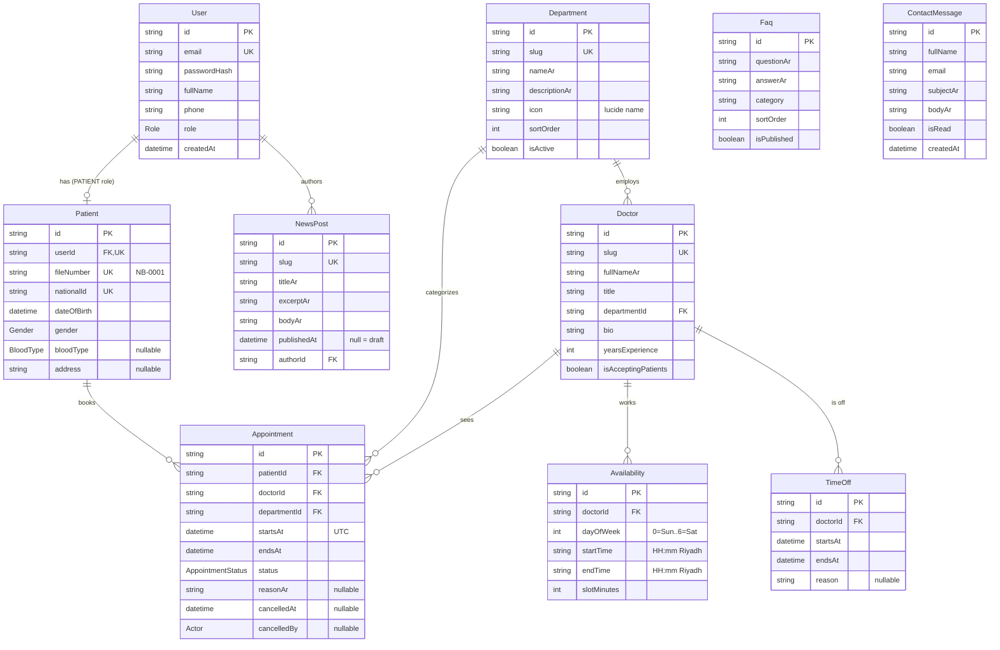

# Data model — ERD

The Prisma schema (`prisma/schema.prisma`) as an entity-relationship diagram.
All `DateTime` columns are stored in UTC.



## Enums

- **Role** — `PATIENT`, `ADMIN`
- **Gender** — `MALE`, `FEMALE`
- **BloodType** — `A_POS`, `A_NEG`, `B_POS`, `B_NEG`, `AB_POS`, `AB_NEG`, `O_POS`, `O_NEG`
- **AppointmentStatus** — `PENDING`, `CONFIRMED`, `COMPLETED`, `CANCELLED`, `NO_SHOW`
- **Actor** — `PATIENT`, `ADMIN`, `SYSTEM`

## The double-booking guard

A raw-SQL **partial unique index** — not expressible in the Prisma schema —
enforces one active appointment per doctor per start time:

```sql
CREATE UNIQUE INDEX appointment_no_double_booking
ON "Appointment" ("doctorId", "startsAt")
WHERE status IN ('PENDING', 'CONFIRMED');
```

Because the `WHERE` clause scopes the index to active statuses, a cancelled or
completed appointment frees its slot for re-booking, while two concurrent active
bookings of the same slot collide — one commits, the other raises Prisma `P2002`,
which the API turns into a `409`.
