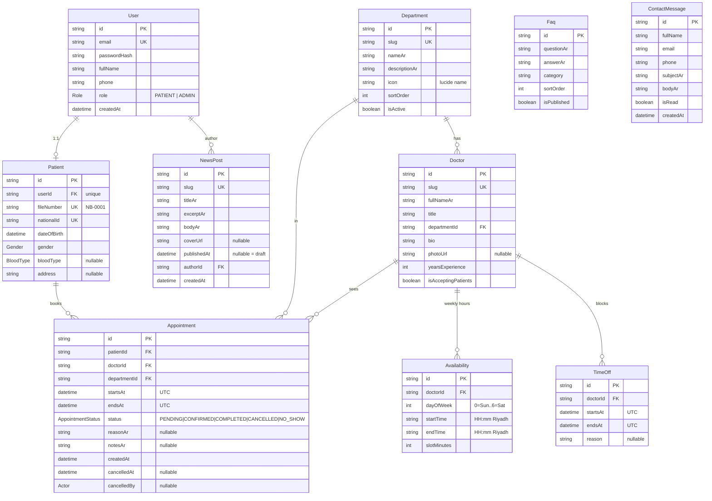

# مخطط قاعدة البيانات — Nabd Hospital (ERD)

النموذج الكامل معرّف في [`prisma/schema.prisma`](../prisma/schema.prisma). كل
حقول `DateTime` مخزّنة بتوقيت UTC وتُعرض بتوقيت آسيا/الرياض عبر
[`src/lib/datetime.ts`](../src/lib/datetime.ts).

> **الأطباء بيانات، لا مستخدمون** — لا توجد علاقة بين `Doctor` و`User` (CLAUDE.md §5).



## الفهرس الحاسم — منع الحجز المزدوج

لا يُعبَّر عنه في مخطط Prisma لأنه فهرس فريد **جزئي** (partial unique index)،
ويُنشأ في هجرة SQL خام:

```sql
CREATE UNIQUE INDEX appointment_no_double_booking
ON "Appointment" ("doctorId", "startsAt")
WHERE status IN ('PENDING', 'CONFIRMED');
```

بهذا الفهرس، أي محاولتين متزامنتين لحجز الطبيب نفسه في اللحظة نفسها تُنتجان
نجاحًا واحدًا (`201`) وتعارضًا نظيفًا واحدًا (`409` من خطأ Prisma `P2002`)،
دون الاعتماد على «افحص ثم أدرج» على مستوى التطبيق. وبما أن الفهرس جزئي، فإن
إلغاء موعد يحرّر اللحظة لتُحجز من جديد.
